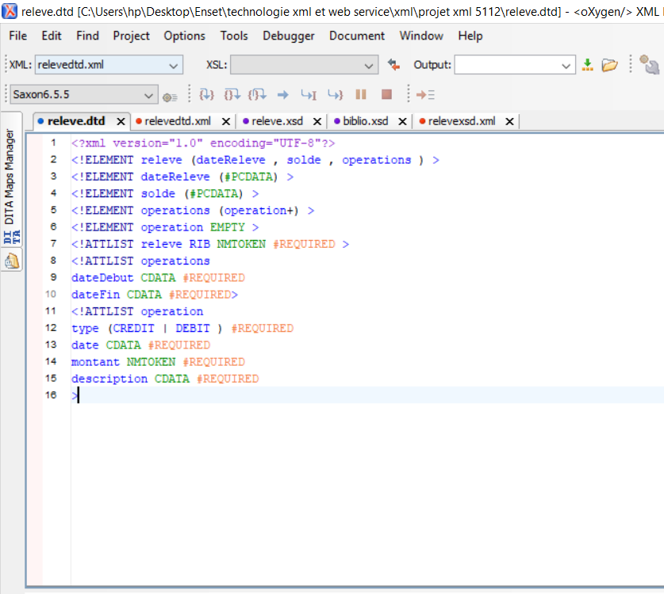
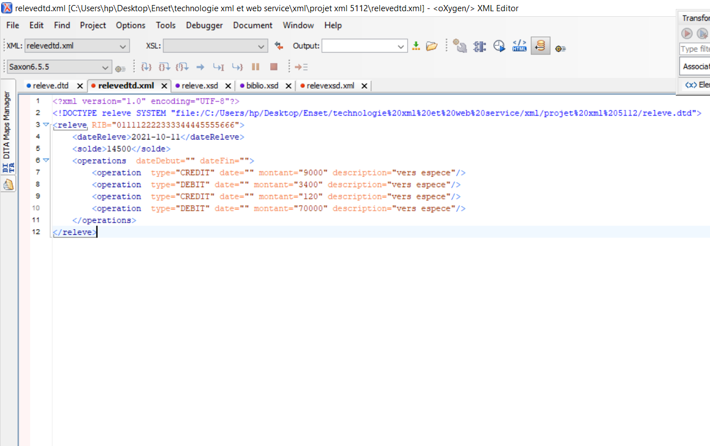

<!DOCTYPE html>
<html lang="en">
<head>
</head>
<body>
    <h3 style="color: brown;"><b>A : Premier Partie XML </b></h3>
    <h3>1. Elaborer la structure graphique de l'arbre XML</h3>

<h3>2. Créer un DTD qui permet de déclarer la structure de ce document XML et créer un
    exemple de document XML valide par ce DTD</h3>
    
    <h4>-- schema xml validee par dtd </h4>
    
<h3>3. Créer un schéma XML qui permet de déclarer la structure de ce document XML et créer
    un exemple de document XML valide par ce schéma XML</h3>
    
    <h4>-- Schema xml validee par xsd</h4>
    
<h3>4. Créer une feuille de style XSL qui permet d’afficher les toutes les données de ce document
    XML au format HTML en affichant le total des opérations de débit et le total des
    opérations de crédit.</h3>
    <a href="https://github.com/yhalim8/ProjetXmlwebservice/blob/main/Partie_A/releve_A4.xsl" ><button> Feuille de style</button></a>
    <h4>format html :</h4>
    
<h3>5. Créer une feuille de style XSL qui permet d"afficher au format HTML les opérations de type
    CREDIT d"un relevé bancaire.</h3>
    <a href="https://github.com/yhalim8/ProjetXmlwebservice/blob/main/Partie_A/releve2_A5.xsl"><button>Feuille de style </button></a>
    <h4>Format html : </h4>
    
    <h3 style="color: brown;"><b>B : Partie Mapping Objet XML avec Jax Binding :</b></h3>
    <h4>Lien Github : </h4>
    <a href="https://github.com/yhalim8/ProjetXmlwebservice/tree/main/Partie_B_C_E/ReleveAPP"><button>Operation</button></a>
    <h3>application Java qui permet de créer un Objet Releve avec quelques opérations
        et de sérialiser ces données dans un fichier XML.</h3>
        
        
    <h3>application Java qui permet de lire et d'afficher les données du relevé du fichier
        XML.</h3>
        
    <h3>application Java qui permet de générer le Schéma XML représentant la
        structure d'un relevé.</h3>
         
         

    

    <h3 style="color: brown;"><b>C : Partie Web services SOAP WSDL avec JaxWS </b></h3>
    <h3>1. Créer un Web services basé sur JaxWS qui permet de consulter un relevé:</h3>
    
    <h3>2. Créer un serveur JaxWS pour déployer le Web service</h3>
    
    <h3>3. Analyser le WSDL en utilisant un Browser Web</h3>
    
    
    <h3>4. Tester les méthodes du Web services en utilisant SoapUI</h3>
    
    <h3>5. Créer un Client SOAP Java.</h3>
    
    
    <h3 style="color: brown;"><b>E. Ajouter des fonctionnalités supplémentaires susceptibles d'améliorer les fonctionnalités de
        votre projet </b></h3>
        
pour l'amelioration j'ai fait une methode pour avoir les operations par types soit credit ou debit

        
        
et voici le test SoapUI

        
</body>
</html>